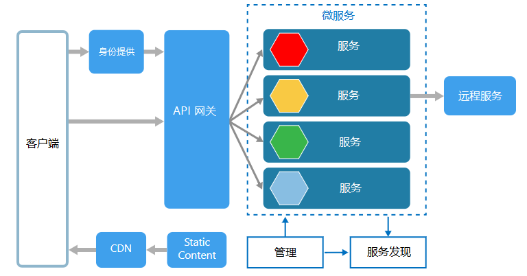

# 微服务架构

原文：[Microservices](https://docs.microsoft.com/zh-cn/azure/architecture/guide/architecture-styles/microservices)

## 什么时候使用微服务架构

建议具有以下情况时使用微服务架构风格：

* 发布频率高的大型应用程序；
* 要求具有高可扩展性的复杂应用程序；
* 具有丰富的领域或子域的应用程序；
* 由小的开发团队构成的组织。

## 什么是微服务架构

微服务架构由一组小型的、自主的服务构成。每个服务都是自包含的，并且应该实现单一的业务功能。

从某种程度上看，微服务是面向服务（SOA）体系架构自然演进，但是微服务与SOA有有所不同。以下是微服务的一些特征定义：

* 在一个微服务架构中，服务是小型、独立、低耦合的；
* 每个服务都是单独的代码库，可以由一个小的开发团队管理；
* 每个服务都可以独立部署。一个团队无需生成和发布整个应用程序，取而代之仅更新已有的服务即可；
* 每个服务只负责持久化他们自己的数据或外部状态。这与传统的模型不同，传统的架构模型需要一个独立的代码层来处理数据持久化；
* 服务之间通过具有明确界限的API来彼此通信，每个服务内部的实现细节由服务隐藏；
* 服务之间无需共享相同的技术栈、代码库或框架。

除了服务本身之外，还有一些其他的组件出现在典型的微服务架构中：

### 管理

管理组件负责替换结点上的服务、识别错误、跨结点调整服务等等。

### 服务发现

服务发现组件负责维护一个列表，列表包含服务及其指向的结点。这样就可以实现服务查找，为每个服务查找对应的结点。

### API 网关

API 网关是客户端的入口点。客户端不会直接调用服务，而是调用 API 网关，网关会将调用指向其后端中合适的服务。API 网关可以聚合来自多个服务的职责，并返回聚合后的响应。

使用 API 网关的优点包括：

* 将客户端与服务分离。服务可以在不更新所有客户端的情况下版本化（发布多个版本）或重构；
* 服务可以使用 非 Web 友好的消息传递协议，比如 AMQP；
* API 网关可以实现其他横切功能，比如认证、日志记录、SSL 终端和负载均衡等等。

## 微服务架构的效益

* **独立部署**。你可以仅更新某个服务，而无需重新部署整个应用程序，并且在出现问题的时候进行回滚，或者滚动更新。修复 BUG 或者发布新功能变得更加可控和低风险；
* **独立开发**。单一的开发团队就可以构建、测试和部署服务，这样就能实现持续创新和更快的发布节奏；
* **小而专注的团队**。团队可以只专注于某个服务。缩小每个服务的范围域使得代码库更易于理解，同时新的团队成员更容易上手；
* **故障隔离**。一个服务的故障不会拖垮整个应用程序。但是这并不意味着你因此获得了服务的弹性，你仍然需要遵循弹性设计的最佳体验和相应的设计模式；
* **混合技术栈**。团队可以随意选取最适合他们的服务的技术。
* **细粒度扩展**。服务可以进行独立的扩展。同时，每个VM（虚拟机）上的服务密度越高，就意味着充分利用了VM资源。使用配置约束的话，一个服务可以匹配到一个VM配置（高CPU，高内存等等）。

## 微服务架构面临的挑战

* **复杂性**。一个微服务应用程序相比等效的整体应用程序具有更多的移动部件。每个服务都非常小，但整个系统作为一个整体却将会更加复杂。
* **开发和测试**。针对服务依赖的开发需要一个不同寻常的方法。现有的工具不一定是被设计用来处理服务依赖的。跨服务边界的重构会变得非常困难。测试服务依赖也是一项挑战，尤其是在应用程序快速发展的阶段。
* **缺乏治理** 用分散处理的方法来构建微服务有其优势，同时也会带来问题。你可能因大量不同语言和框架造成的应用程序难以维护而终结。在不过分限制团队灵活性的情况下，将一些项目级的标准放在适当的位置可能会很有用。这尤其适用于像日志记录这样的横切功能。
* **网络拥塞和延迟** 大规模使用小粒度的服务将导致大量服务交互通信。还有，如果服务依赖链变得太长（服务A调用服务B，服务B调用服务C......），额外的延迟就不可忽视。你需要细心地设计API，避免“太健谈”的API，考虑序列化格式，在恰当的地方使用异步通信模式。
* **数据完整性** 由于每个微服务只负责它自己的数据持久化，因此保持数据的完整一致成了新的挑战。如果可以，拥抱最终一致性。
* **管理** 要想成功驾驭微服务架构，必须要有一个成熟的 DevOps（开发运维） 文化。跨服务相关的日志记录会变得极具挑战性。通常，日志记录必须将单个请求产生的多个服务调用记录关联起来。
* **版本控制** 更新服务的时候，必须确保依赖于它的服务不被打断。多个服务可以在任何给定的时间更新，因此如果没有精心的设计，你可能会面临向前或向后兼容性的问题。
* **整体技能** 微服务是高度分布的系统。你要仔细评估你的团队技能和经验以确保项目成功。

## 微服务架构的最佳体验

* 围绕业务领域的模型服务；
* 分散一切，各个团队都负责设计和构建服务，避免共享代码或数据模式；
* 数据存储对于数据所有者来说是私有的，这实现了每个服务和数据类型的最佳存储；
* 服务通过设计良好的API通信，这可以避免泄露实现细节。API 应该面向领域建模，而不是服务的内部实现；
* 避免服务间的耦合，造成耦合的原因包括共享数据库模式和严格的通信协议；
* 将横切关注点从 API 网关分离出来，比如认证和 SSL 终端；
* 将领域知识维持在网关之外。网关应该在不了解业务规则或领域逻辑的情况下处理和路由客户端请求。否则，网关会变得强依赖和导致服务之间的高度耦合；
* 服务之间应该是松散耦合、高功能内聚的。有可能同时变更的功能应该打包和部署在一起，因为如果他们驻留在独立的服务中，那些服务会由于越来越紧密的耦合而被结束 —— 一个服务的变更将要求更新其他服务。两个服务之间的过度通信可能是紧耦合、低内聚的征兆；
* 故障隔离，使用弹性策略可以将服务故障从服务间的关联中隔离出来。查看[弹性模式](https://docs.microsoft.com/zh-cn/azure/architecture/patterns/category/resiliency)和[设计弹性应用程序](https://docs.microsoft.com/zh-cn/azure/architecture/resiliency/index)已了解更多信息。